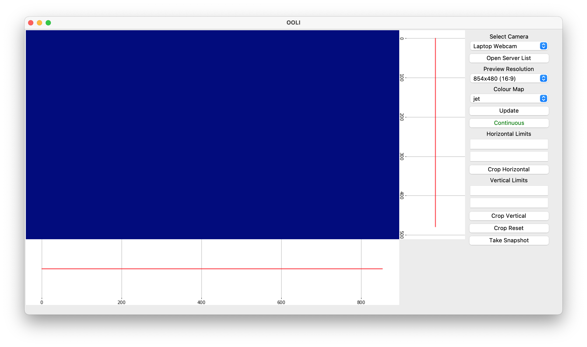

# Open Optics Laboratory Interface (OOLI)

## About this Project
OOLI is an open-source software project for managing and interfacing with
socketed data from detection devices.

## Features
- Manage and edit a server list for connection to different devices
- Camera viewer app for viewing images from detectors

## Usage
- Make and activate the conda environment for your system.

For windows:
```sh
conda env create -f environments/environment_windows.yml
conda activate OOLI
```
For macOS:
```sh
conda env create -f environments/environment_macos.yml
conda activate OOLI
```
- Then run the app using:
```sh
python run.py
```

## Screenshots


## Todo
- [x] Make environment system agnostic
- [x] Merge socketing project
- [ ] Add beam measurement feature

## License
This project is licensed under the terms of the GNU General Public License v3.0.
